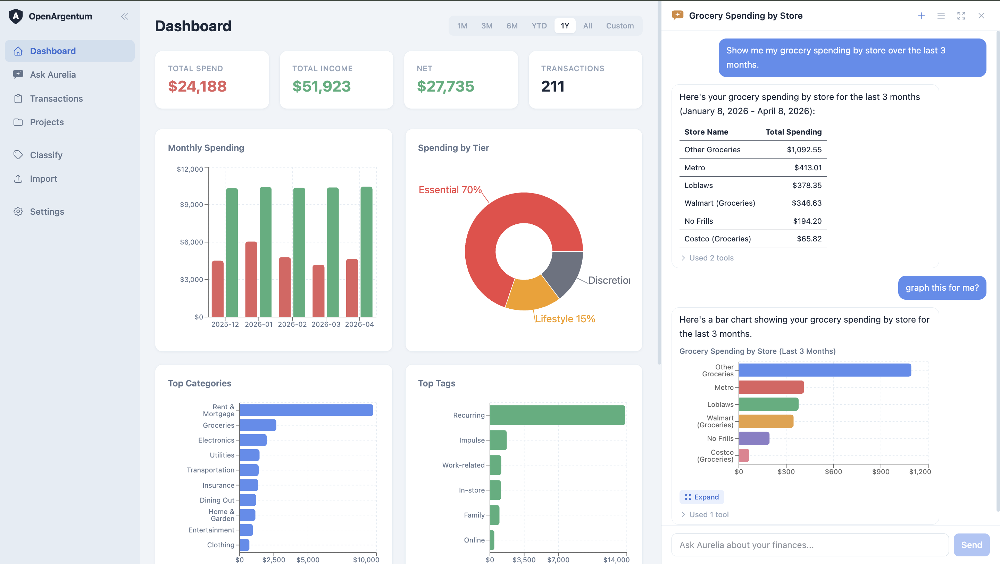
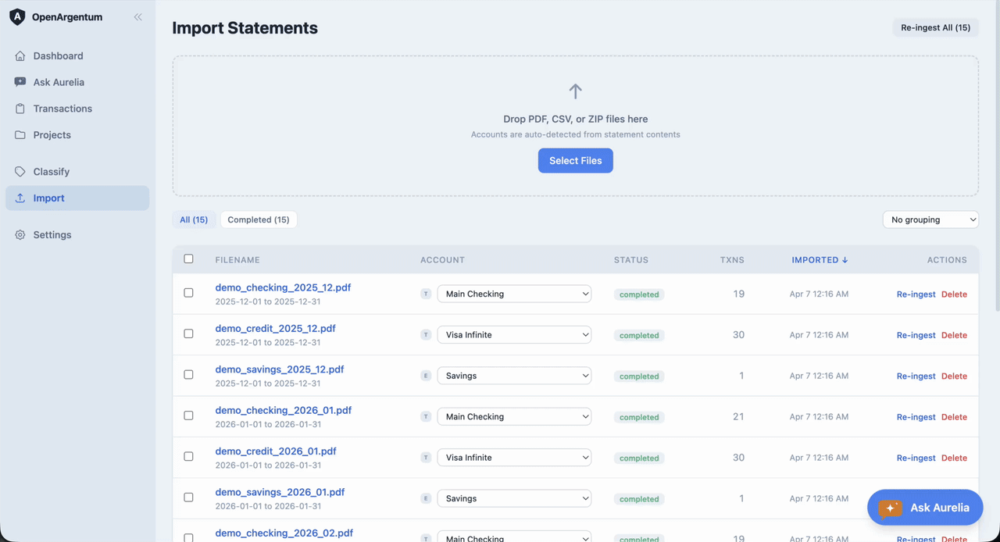
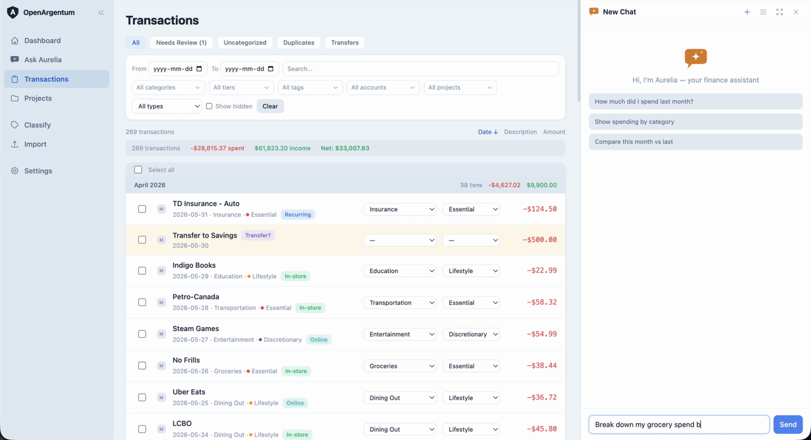
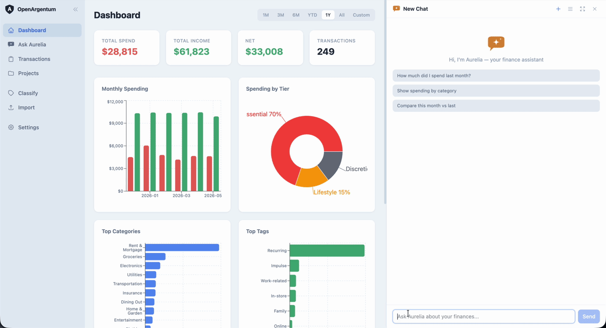
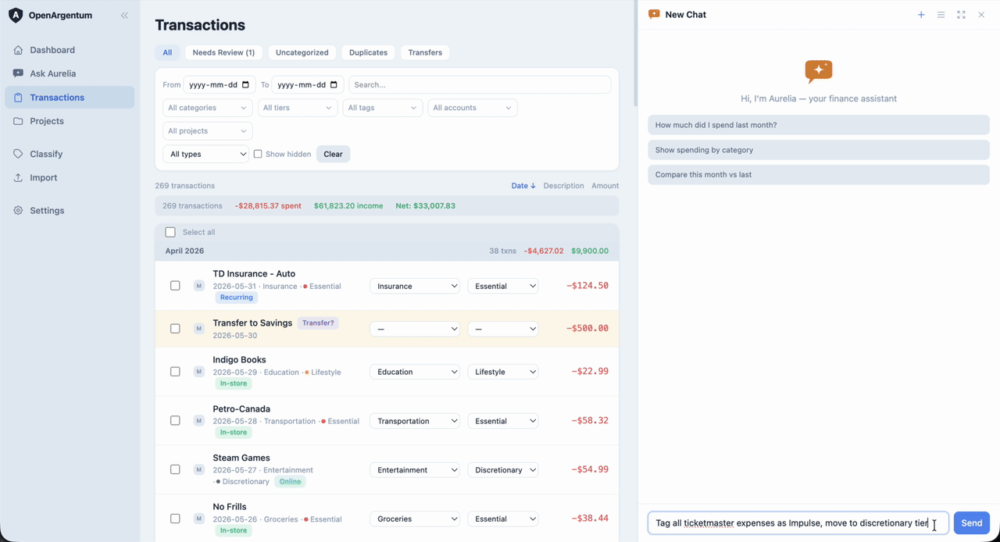

<p align="center">
  
</p>

<h1 align="center">OpenArgentum</h1>

<p align="center">
  A self-hosted, AI-powered personal finance manager that runs entirely on your own machine.
</p>

<p align="center">
  <a href="LICENSE"></a>
  <a href="https://github.com/amithmathew/OpenArgentum/stargazers"></a>
</p>

- **AI-powered import** -- Drop in your bank statements (PDF, CSV, or ZIP). AI extracts every transaction, assigns categories and tags, and catches duplicates automatically.
- **Conversational finance** -- Ask Aurelia, your built-in AI assistant, anything about your spending. Get charts, insights, and safe bulk edits through plain English.
- **Your data, no lock-in** -- All data lives in a local SQLite database on your machine. No cloud sync, no account, no telemetry. You own your data and can do whatever you want with it.
- **One command setup** -- `./start.sh` handles everything. No Docker, no database server, no config files.
- **Mobile-friendly** -- Works on your phone too. Responsive design with touch-optimized controls.

<p align="center">
  
</p>

---

## Quick Start

**You need:** Python 3.11+, Node.js 20.19+, and a [free Google Gemini API key](https://aistudio.google.com/apikey) (or existing Google Cloud Application Default Credentials)

```bash
git clone https://github.com/amithmathew/OpenArgentum.git
cd OpenArgentum
./start.sh
```

Open **http://localhost:8099** and the onboarding wizard will walk you through setup.

> **That's it.** `start.sh` creates a Python virtual environment, installs all dependencies, builds the app, and starts the server. See [Getting Started](GETTING_STARTED.md) for a detailed walkthrough.

---

## Try the Demo — no API key needed

Want to look around before importing your own statements? OpenArgentum ships with a sample database of realistic transactions.

1. Clone and launch as shown in [Quick Start](#quick-start) — you can skip the API key step in onboarding for now.
2. Open **Settings → Databases** and switch to the **Demo** database.
3. Explore the dashboard, transactions, projects, and charts with pre-loaded data.

> **Fastest path:** run `./start.sh --demo` to boot straight into the demo database with no onboarding and no key required.

Browsing the demo makes no external calls and needs no Gemini key — only statement import and the Aurelia assistant require one. Any changes you make to the demo reset when you restart the server.

---

## Import Your Statements

Drop your bank and credit card statements into OpenArgentum and let AI do the rest.

- Supports PDF and CSV files (individually or ZIP-archived) -- just drag and drop
- AI reads every transaction, figures out the category, and adds relevant tags
- Overlapping statements? Duplicates are caught automatically
- Already uploaded that file? It won't import twice
- Process multiple files in a row -- they queue up in the background

<p align="center">
  
</p>

---

## Meet Aurelia


Aurelia is your AI finance assistant. She lives inside OpenArgentum, has direct access to your data, and can answer questions, build charts, and make changes -- all through conversation.

<br clear="left" />

### Ask anything about your money

> *"How much did I spend on dining out last quarter?"*
>
> *"Show me my grocery spending by store over the last 3 months"*
>
> *"What's my average monthly grocery bill?"*

Aurelia queries your data, summarizes the answer, and renders charts right in the chat.

<p align="center">
  
</p>

### Understand your spending patterns

> *"Why were my January expenses so much higher than December?"*
>
> *"Compare my essential vs discretionary spending this year"*

Aurelia breaks down the numbers, highlights what changed, and explains why.

<p align="center">
  
</p>

### Make bulk changes safely

> *"Tag all my Ticketmaster expenses as Impulse and move them to discretionary"*
>
> *"Create a project called 'Home Renovation' and add all Home Depot transactions"*

Aurelia shows you exactly what will change and waits for your approval. Every change can be undone with one click.

<p align="center">
  
</p>

### Conversation memory

Aurelia remembers your past conversations. Pick up where you left off, or start a new chat anytime.

---

## Dashboard & Analytics

See where your money goes at a glance.

- Summary cards for total spend, income, net cash flow, and transaction count
- Interactive charts: monthly spending, spending by tier, top categories, top tags, and trends over time
- Click any chart element to drill down to the matching transactions
- Filter by time period (1 month, 3 months, YTD, custom range, and more)

## Transaction Management

Every transaction at your fingertips.

- Filter by date, category, tag, account, search text, and more
- Monthly grouping with subtotals
- Add, remove, or create tags inline
- Multi-select for bulk operations (categorize, tag, assign to projects)
- Expandable rows for full details including original bank description
- Flagged transfers and duplicates for easy review

## Categories, Tiers & Tags

Organize your spending the way that makes sense to you.

- Three spend tiers out of the box: **Essential**, **Lifestyle**, **Discretionary** (fully customizable)
- Categories are created automatically during import -- review and confirm them at your own pace
- Batch-categorize unconfirmed transactions with one click
- Tags for cross-cutting labels like merchants, recurring expenses, or custom markers

## Projects & Budgets

Track spending against goals.

- Create projects and assign transactions (manually or ask Aurelia)
- Set budget targets with progress tracking
- Per-project category breakdowns
- Archive completed projects to keep things tidy

## Themes

Eight built-in color themes.

**Light:** Mist, Rose, Sage, Ember, Ocean, Slate -- **Dark:** Nightfall, Aurora

## Access from Your Phone

Run with `./start.sh --headless` to access OpenArgentum from any device on your local trusted network. A PIN is generated automatically to keep things secure.

---

## Privacy & Security

OpenArgentum stores everything locally and reaches out to exactly one external service, on purpose.

- **Local-first storage.** All your data lives in a SQLite database on your machine — easy to back up, export, or inspect. No cloud sync, no account, no telemetry, no tracking.
- **One external call, by design.** To read and categorize your statements, the contents of the files you import are sent to the Google Gemini API. That is the only data that leaves your machine, and it only happens for AI features — statement import and the Aurelia assistant. Browsing your existing data makes no external calls.
- **No live bank connections.** OpenArgentum only works with statements and exports you already have; it never connects to your bank.
- **Network access is off by default.** When you enable it with `--headless`, it's protected by an auto-generated PIN with brute-force protection.
- **Localhost is unauthenticated.** Anything running on your machine can reach the app on localhost, so treat your own machine as the trust boundary.

### How Google handles the data you send to Gemini

Because your statements leave your machine to reach Gemini, **how Google may use that data matters** — and it differs by tier. **We recommend using Google's paid data terms** for real financial data:

- **Enable [Cloud Billing](https://ai.google.dev/gemini-api/docs/billing) on the Google Cloud project behind your API key, or use Google Cloud credentials (Vertex AI).** Under the paid terms, Google **does not use your prompts or responses to train its models** or have them reviewed by humans, and processes them under the [Data Processing Addendum](https://ai.google.dev/gemini-api/terms). Billing *status* — not spend — is what applies these terms, so you can stay within the free usage quota and still be protected.
- **A free API key with no billing uses the "Unpaid" tier**, where Google uses your content to improve its products and human reviewers may read it. Google's own terms state: *"Do not submit sensitive, confidential, or personal information to the Unpaid Services."* Bank statements are exactly that, so we don't recommend the free tier for real financial data — it's fine for the demo or throwaway data.

| | Free / Unpaid (no billing) | Paid (billing enabled) | Vertex AI (Google Cloud) |
|---|---|---|---|
| Used to improve Google products / train models | Yes | No | No |
| Human review of prompts & responses | Yes (identifiers stripped first) | No | No (abuse-monitoring only; [opt-out available](https://cloud.google.com/vertex-ai/generative-ai/docs/data-governance)) |
| Governed by a Data Processing Addendum | No | Yes | Yes (Cloud DPA) |
| Google's guidance | "Do not submit sensitive, confidential, or personal information" | Suitable for sensitive data | Enterprise data terms |

Sources: [Gemini API Additional Terms](https://ai.google.dev/gemini-api/terms) · [Data logging policy](https://ai.google.dev/gemini-api/docs/logs-policy) · [Vertex AI data governance](https://cloud.google.com/vertex-ai/generative-ai/docs/data-governance). **These terms are set by Google and can change at any time — you are responsible for reviewing the current terms before sending real data.**

---

## Updating

Your data is safe across updates. Pull the latest code and restart:

```bash
git pull
./start.sh
```

Your database, config, and uploaded files live in the `data/` directory which is never touched by git. Database migrations run automatically on startup.

---

## Configuration

### API Key Setup

For **real financial data we recommend Google's paid data terms** — see [How Google handles the data you send to Gemini](#how-google-handles-the-data-you-send-to-gemini) above for why. Both options below work; enabling [Cloud Billing](https://ai.google.dev/gemini-api/docs/billing) on your key's project (Option A) or using Google Cloud credentials (Option B) puts you on the paid terms.

**Option A: API Key**
1. Get a key from [Google AI Studio](https://aistudio.google.com/apikey)
2. Enter it during onboarding, or later on the Settings page
3. For paid data terms, enable [Cloud Billing](https://ai.google.dev/gemini-api/docs/billing) on the key's Google Cloud project (you can stay within the free quota). Without billing, the key uses the Unpaid tier — fine for the demo, not for real statements.

**Option B: Google Cloud credentials (Vertex AI)** — enterprise data terms
1. Install the [Google Cloud CLI](https://cloud.google.com/sdk/docs/install)
2. Run `gcloud auth application-default login`
3. Select "Application Default Credentials" during onboarding

### Environment Variables

| Variable | Default | Description |
|---|---|---|
| `GOOGLE_API_KEY` | -- | Gemini API key (can also be set through the UI) |
| `GEMINI_MODEL` | `gemini-2.5-flash` | Gemini model to use |
| `PORT` | `8099` | Server port |

Most users won't need these -- the UI handles everything.

### Command Reference

```
./start.sh                         # Start the app
./start.sh --demo                  # Boot into the demo database (no key, no onboarding)
./start.sh --dev                   # Development mode with hot reload
./start.sh --headless              # Enable network access (auto-generates PIN)
./start.sh --headless --pin 1234   # Network access with a specific PIN
./start.sh --help                  # Show all options
```

---

<details>
<summary><strong>Developer Details</strong></summary>

<h3>Architecture</h3>

<pre>
openargentum/
  start.sh              # One-command setup and launch
  run.py                # Server entry point

  backend/              # Python + FastAPI
    app.py              # App init, auth middleware, routing
    config.py           # Paths, env vars, config helpers
    database.py         # SQLite schema and migrations
    models.py           # Request/response models
    routers/            # REST API endpoints
    services/           # Gemini client, ingestion, categorization,
                        #   chat tools, mutations

  frontend/             # React + Vite + TailwindCSS
    src/
      pages/            # Dashboard, Transactions, Categories,
                        #   Projects, Import, Settings
      components/       # ChatPanel (Aurelia), OnboardingWizard,
                        #   AppLogo, InstitutionIcon
      hooks/            # useIsMobile

  data/                 # Created at runtime (gitignored)
    finance.db          # SQLite database
    config.json         # App configuration
    statements/         # Uploaded files
    snapshots/          # Database snapshots
    sandboxes/          # Aurelia analysis sandbox DBs
</pre>

<h3>Tech Stack</h3>

<p><strong>Backend:</strong> Python 3, FastAPI, SQLite, google-genai SDK, pdfplumber</p>

<p><strong>Frontend:</strong> React 19, Vite, TailwindCSS, Recharts, TanStack React Query</p>

<p><strong>AI:</strong> Google Gemini 2.5 Flash</p>

<h3>Development</h3>

<pre>
./start.sh --dev
</pre>

<p>This starts the Vite dev server with hot module replacement and the backend with auto-reload. The Vite dev server proxies <code>/api</code> requests to the backend.</p>

</details>
